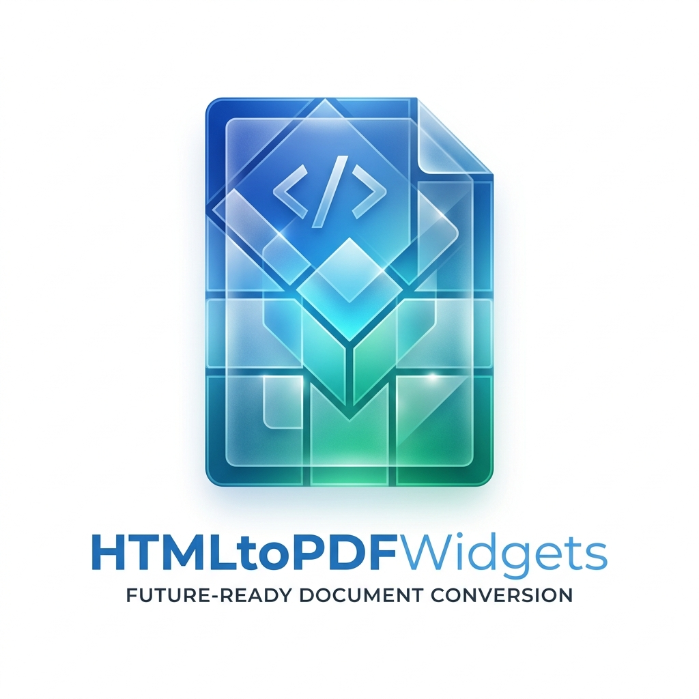
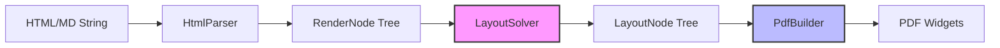

<p align="center">
  
</p>

# HTMLtoPDFWidgets 🚀
### Build Professional PDFs from HTML & Markdown with Pixel-Perfect Precision

[](https://pub.dev/packages/htmltopdfwidgets)
[](https://opensource.org/licenses/MIT)
[](https://github.com/alihassan143/htmltopdfwidgets/actions)
[](https://www.buymeacoffee.com/alihassan13)

---

**`htmltopdfwidgets`** is a high-performance rendering engine designed for Flutter and Dart. It goes beyond simple tag mapping, providing a **Layout-First** pipeline that mimics browser rendering to ensure your PDFs look exactly like your web content.

> [!TIP]
> **AI-Ready Documentation**: If you're using an AI assistant (like Claude, GPT, or Copilot) to help with this repository, point it to [llm.txt](./llm.txt) for a deep dive into the architecture and logic.

---

### ❤️ Support the Core Maintainer
If this project saves you time, consider buying me a coffee! It helps keep the development alive and the energy high.

<a href="https://www.buymeacoffee.com/alihassan13" target="_blank">
  
</a>

---

## 🌟 Why htmltopdfwidgets?

Generating PDFs from HTML is often messy. This package solves that by introducing a **Browser-Grade Rendering Pipeline**.

- **🎯 Precision Scaling**: Automatically scales $1px$ to $0.75pt$, matching the industry standard for High-DPI PDF generation.
- **🔳 Full Box Model**: Respects `width`, `height`, `padding`, `margin`, and `border` with CSS-like cascading.
- **🏗️ Native Flexbox**: Turn `display: flex` rows and columns into native PDF widgets seamlessly.
- **📄 Advanced Pagination**: Intelligent content breaking prevents text clipping and ensures tables break gracefully across pages.
- **🖼️ Media Ready**: Handles network images, local files, and custom SVG paths.

---

## 🛠️ How it Works (The Pipeline)

Our new **Layout-First** architecture ensures consistent results across all document types.



---

## 🚀 Installation

Add it to your `pubspec.yaml`:

```yaml
dependencies:
  htmltopdfwidgets: ^2.1.0
```

---

## 📖 Usage Guide

### 📂 Using the Modern Browser Engine (Recommended)
The modern engine is built for accuracy and complex CSS.

```dart
import 'package:htmltopdfwidgets/htmltopdfwidgets.dart';

final String htmlContent = '''
  <div style="padding: 24px; background-color: #f8f9fa; border: 2px solid #007bff; border-radius: 8px;">
    <h1 style="color: #007bff; text-align: center;">Invoicing Simplified</h1>
    <div style="display: flex; flex-direction: row; justify-content: space-between; margin-top: 20px;">
      <div style="flex-grow: 1;">
        <p><b>Client:</b> John Doe</p>
        <p><b>Date:</b> April 16, 2024</p>
      </div>
      <div style="width: 150px; text-align: right;">
        <p style="font-size: 24px;">$1,250.00</p>
      </div>
    </div>
  </div>
''';

void main() async {
  final widgets = await HTMLToPdf().convert(
    htmlContent,
    useNewEngine: true, // Unleash the Layout-First power
  );

  final pdf = Document();
  pdf.addPage(MultiPage(build: (context) => widgets));
  
  // Save or preview your PDF
}
```

### 📝 Markdown to PDF
Directly convert Markdown rich text into structured PDF documents.

```dart
final markDown = '''
# 📖 Project Documentation
---
> Building better PDFs together.

### Features
- [x] High-performance rendering
- [x] **Flexbox** support
- [x] Custom font fallbacks
''';

final List<Widget> widgets = await HTMLToPdf().convertMarkdown(markDown);
```

---

## 🎨 Advanced Features

### 🌈 Custom Styling
Override any tag's default style with a single object.

```dart
final widgets = await HTMLToPdf().convert(
  html,
  tagStyle: HtmlTagStyle(
    h1Style: pw.TextStyle(color: PdfColors.blue900, fontWeight: pw.FontWeight.bold),
    pStyle: pw.TextStyle(lineSpacing: 2.0),
  ),
);
```

### 🌍 Global Language Support & Emojis
Using `fontFallback` allows you to render Emojis and non-Latin scripts (Arabic, Kanji, etc.) effortlessly.

```dart
final widgets = await HTMLToPdf().convert(
  'Success! 🚀 ✅ Done.',
  fontFallback: [emojiFont, mainFont],
);
```

---

## 📦 Tag Support Matrix

| Category | Supported Elements |
| :--- | :--- |
| **Typography** | `h1-h6`, `p`, `span`, `b`, `strong`, `i`, `em`, `u`, `br`, `hr`, `code`, `pre` |
| **Containers** | `div`, `section`, `article`, `header`, `footer`, `nav`, `aside`, `main` |
| **Lists** | `ul`, `ol`, `li` |
| **Layout** | `table`, `thead`, `tbody`, `tr`, `th`, `td`, `blockquote` |
| **Interactive** | `a` (links), `input[type="checkbox"]` |
| **Media** | `img` (Base64, Network, File) |

---

## 🤝 Contributing

We love contributions! If you have an idea to make this engine even more powerful, please:
1.  Fork the repo.
2.  Create your feature branch.
3.  Submit a PR!

**License**: MIT | **Maintainer**: [Ali Hassan](https://github.com/alihassan143)

